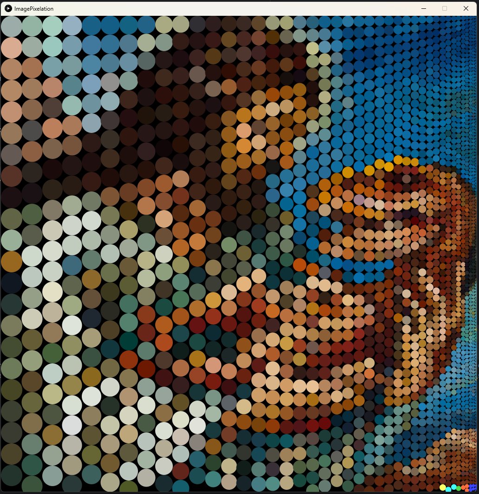
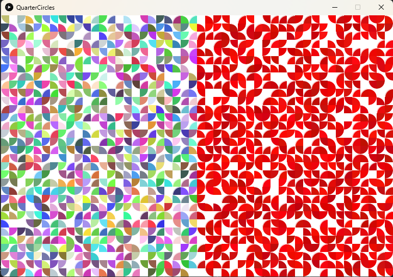

Hey, ich bin eher ein Fan von Markdown und idk, ob das auf Moodle auch geht, daher erst mal hier:

JDK 17 required.

Author: Oliver Rausch (Stellen sind gekennzeichnet, sollte es nicht mein Code sein)

# Übungen
Bei den meisten Übungen hab ich eigentlich nur die Anforderung umgesetzt. Soviel Kreativität gibt's bei mir nicht.

## 1.1 Zufällige Kreise

Standard

## 1.2 Bild zu Kreisen

Das Originalbild ist Jesus wie er ein ganz normales Baby hält.

## 2.1 Space Invader

Standard

## 2.2 Space Invader (rund und mit 3 Ecken)
Hier hab ich die Space Invader etwas anders aufgezogen. Bei 2.2.2 und 2.2.3 werden einfach mehrere Invader übereinandergelegt.
## 2.2.1 Einzelner Invader

Eigentlich normale Space Invader nur, dass nicht nur Quadrate verwendet wurden.

## 2.2.2 5 Invader übereinander

Hier werden 5 übereinander gelegt, wodurch es abgespaced wird.

## 2.2.3 200 Invader übereinander

Ja, hier werden 200 übereinandergelegt... Ich weiß auch nicht warum... Ein wenig cursed.

## 2.3 Halbkreise

Standard

## 2.4 3D Kreise

Hierbei ist ein 3D Effekt entstanden, weil ich anfangs noch nicht pushMatrix/popMatrix/translate verwendet habe und stattdessen ein eigenes Array aufgezogen habe.
Dadurch ist irgendwas wohl schief gelaufen und manche weiße Kreise sind über anderen schwarzen Kreisen.

## 3.1 Rotierende und skalierende Quadrate

Durch die linke Maustaste werden die Quadrate bunt und der border verschwindet.
Durch die Rechte wird der border dicker und sie werden transparent.
Ein wenig chaotisch :)

## 3.1.x Rotierende und skalierende Kreise

Hier benutze ich wieder meine komische buggy Weise (ohne push/pop/translate) und das Ergebnis ist naja.. Ein Unfall!

## 3.2 Weitere rotierende und skalierende Quadrate

Standard

## 3.3 Mandala

Standard

## 4.1 Kreiskollisionen

Standard

## 4.2 Shot 'em up

Standard

## 5.1 Fractals

Hier hab ich endlich davon Wind bekommen, dass man sowas wie pushMatrix / popMatrix / usw. verwenden kann. :D

## 5.2 Anziehende Kreise

Standard feats:
 - Der Cursor zieht die Kreise an und stoßt diese ab (Links -/ Rechtsklick).
 - Kreise kollidieren nicht miteinander.
 - Gravitation ist etwas "cracked"

## 6.1 Zahnradsimulation

Hier hab ich die meiste Zeit reingesteckt, aber ist ganz entspannt geworden..
Man kann halt Zahnräder platzieren und die Rotationen werden (ich glaube) richtig übertragen. :D
Wenn man das Programm startet, kommt ein kleines help popup, welches die Eingaben erklärt (ansonsten bei keyPressed/mouseClicked im Code gucken)

## 7.1 Pfützen?

Das hätte eigentlich ein Partikelsystem sein sollen. Ist es eigentlich auch, aber es sieht ein wenig traurig aus..
Mit Rechtsklick platziert man ein Partikelsystem, welches Kreise spawned, nachdem diese verschwunden sind.
Mit Linksklick platziert man ein einziges Partikelsystem, welches nur eine Kreisiteration durchmacht.

## 7.2 Regen

Das ist jetzt kein Partikelsystem mehr, aber zumindest sieht's ein wenig besser aus. xD

## 8.1 Fische

Es bilden sich Fischschulen und es regnet. (Die Fische sind Agents)
Wenn man genau hinguckt, sieht man, dass sich sogar die Schwanzflossen bewegen.. Im Nachhinein betrachtet eigentlich recht unnötig. :D
Die Logik (agents) hab ich 1:1 aus dem offiziellen processing Tutorial übernommen. Hier bin ich Tatsache etwas faul geworden.

# Extras
## Extra 1 Primzahlen in Polarkoordinaten

Hierbei werden lediglich im Hintergrund Primzahlen berechnet und in einer Liste gespeichert.
Durch das Mausrad oder Maustasten wird dann gezoomed und die Position/Sichtbarkeit der Punkte berechnet.
[Idee von hier](https://www.youtube.com/watch?v=EK32jo7i5LQ)

## Extra 2 Aneinanderhängende Vektoren

Zwei Vektoren werden aneinandergehangen und beiden wird jeweils eine eigene Drehgeschwindigkeit gegeben.
Mit ganz viel Glück, entsteht hier auch mal ein perfekter Schwingkreis, aber meistens wiederholt es sich leicht versetzt, wodurch auf Dauer alles ausgemalt wird.
Origin der Idee war es eigentlich mit ganz vielen Vektoren ein Bild zu malen, aber dafür müsste ich mich mit noch mehr mit der Fourier-Reihe auseinandersetzen..
[Idee von hier](https://www.youtube.com/watch?v=r6sGWTCMz2k)
___
